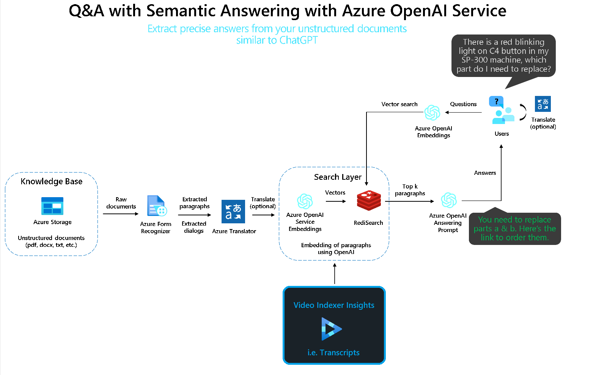

# Azure OpenAI Embeddings QnA

A simple web application for a OpenAI-enabled document search. This repo uses Azure OpenAI Service for creating embeddings vectors from documents. For answering the question of a user, it retrieves the most relevant document and then uses GPT-3 to extract the matching answer for the question.



# Running this repo
You have multiple options to run the code:
-   [Deploy on Azure (WebApp + Redis Stack)](#deploy-on-azure-webapp--redis-stack)
-   [Run everything locally in Docker (WebApp + Redis Stack)](#run-everything-locally-in-docker-webapp--redis-stack)
-   [Run everything locally in Python with Conda (WebApp only)](#run-everything-locally-in-python-with-conda-webapp-only)
-   [Run everything locally in Python with venv](#run-everything-locally-in-python-with-venv)
-   [Run WebApp locally in Docker against an existing Redis deployment](#run-webapp-locally-in-docker-against-an-existing-redis-deployment)

## Deploy on Azure (WebApp + Redis Stack)
[](https://portal.azure.com/#create/Microsoft.Template/uri/https%3A%2F%2Fraw.githubusercontent.com%2Fruoccofabrizio%2Fazure-open-ai-embeddings-qna%2Fmain%2Finfrastructure%2Fdeployment.json)

Click on the Deploy to Azure button and configure your settings in the Azure Portal as described in the [Environment variables](#environment-variables) section.

Please be aware that you need:
-   an existing OpenAI with deployed models (instruction models e.g. text-davinci-003, and embeddings models e.g. text-search-davinci-doc-001 and text-search-davinci-query-001) 
-   an existing Form Recognizer Resource (OPTIONAL - if you want to extract text out of documents)
-   an existing Translator Resource (OPTIONAL - if you want to translate documents)

## Run everything locally in Docker (WebApp + Redis Stack)

First, clone the repo:

```console
git clone https://github.com/ruoccofabrizio/azure-open-ai-embeddings-qna
cd azure-open-ai-embeddings-qna
```

Next, configure your `.env` as described in [Environment variables](#environment-variables):


```console
cp .env.template .env
vi .env # or use whatever you feel comfortable with
```

Finally run the application:

```console
docker compose up
```

Open your browser at [http://localhost:8080](http://localhost:8080)

This will spin up two Docker containers:
-   The WebApp itself
-   Redis Stack for storing the embeddings

## Run everything locally in Python with Conda (WebApp only)

This requires Redis running somewhere and expects that you've setup `.env` as described above. In this case, point `REDIS_ADDRESS` to your Redis deployment. 

You can run a local Redis instance via:
```console
 docker run -p 6379:6379 redis/redis-stack-server:latest
```

Create `conda` environment for Python:

```console
conda env create -f code/environment.yml
conda activate openai-qna-env
```

Configure your `.env` as described in as described in [Environment variables](#environment-variables)

Run WebApp:
```console
cd code
streamlit run OpenAI_Queries.py
```

## Run everything locally in Python with venv
This requires Redis running somewhere and expects that you've setup `.env` as described above. In this case, point `REDIS_ADDRESS` to your Redis deployment. 

You can run a local Redis instance via:
```console
 docker run -p 6379:6379 redis/redis-stack-server:latest
```

Please ensure you have Python 3.9+ installed.

Create `venv` environment for Python:

```console
python -m venv .venv
.venv\Scripts\activate
```

Install `PIP` Requirements
```console
pip install -r code\requirements.txt
```

Configure your `.env` as described in as described in [Environment variables](#environment-variables)

Run the WebApp
```console
cd code
streamlit run OpenAI_Queries.py
```

## Run WebApp locally in Docker against an existing Redis deployment

### Option 1 - Run the prebuilt Docker image

Configure your `.env` as described in as described in [Environment variables](#environment-variables)

Then run:

```console
docker run -e .env -p 8080:80 fruocco/oai-embeddings:latest
```

### Option 2 - Build the Docker image yourself

Configure your `.env` as described in as described in [Environment variables](#environment-variables)

```console
docker build . -t your_docker_registry/your_docker_image:your_tag
docker run -e .env -p 8080:80 your_docker_registry/your_docker_image:your_tag
```


## Environment variables

Here is the explanation of the parameters:

| App Setting | Value | Note |
| --- | --- | ------------- |
|OPENAI_ENGINES|davinci-002,text-curie-001,text-babbage-001,text-ada-001|Instruction engines deployed in your Azure OpenAI resource|
|OPENAI_EMBEDDINGS_ENGINE_DOC | text-search-davinci-doc-001  | Embedding engine for documents deployed in your Azure OpenAI resource|
|OPENAI_EMBEDDINGS_ENGINE_QUERY | text-search-davinci-query-001  | Embedding engine for query deployed in your Azure OpenAI resource|
|OPENAI_API_BASE | https://YOUR_AZURE_OPENAI_RESOURCE.openai.azure.com/ | Your Azure OpenAI Resource name. Get it in the [Azure Portal](https://portal.azure.com)|
|OPENAI_API_KEY| YOUR_AZURE_OPENAI_KEY | Your Azure OpenAI API Key. Get it in the [Azure Portal](https://portal.azure.com)|
|REDIS_ADDRESS| api | URL for Redis Stack: "api" for docker compose|
|REDIS_PASSWORD| redis-stack-password | OPTIONAL - Password for your Redis Stack|
|REDIS_ARGS | --requirepass redis-stack-password | OPTIONAL - Password for your Redis Stack|


Optional parameters for additional features (e.g. document text extraction with OCR):

| App Setting | Value | Note |
| --- | --- | ------------- |
|BLOB_ACCOUNT_NAME| YOUR_AZURE_BLOB_STORAGE_ACCOUNT_NAME| OPTIONAL - Get it in the [Azure Portal](https://portal.azure.com) if you want to use the document extraction feature |
|BLOB_ACCOUNT_KEY| YOUR_AZURE_BLOB_STORAGE_ACCOUNT_KEY| OPTIONAL - Get it in the [Azure Portal](https://portal.azure.com)if you want to use document extraction feature|
|BLOB_CONTAINER_NAME| YOUR_AZURE_BLOB_STORAGE_CONTAINER_NAME| OPTIONAL - Get it in the [Azure Portal](https://portal.azure.com) if you want to use document extraction feature|
|FORM_RECOGNIZER_ENDPOINT| YOUR_AZURE_FORM_RECOGNIZER_ENDPOINT| OPTIONAL - Get it in the [Azure Portal](https://portal.azure.com) if you want to use document extraction feature|
|FORM_RECOGNIZER_KEY| YOUR_AZURE_FORM_RECOGNIZER_KEY| OPTIONAL - Get it in the [Azure Portal](https://portal.azure.com) if you want to use document extraction feature|
|TRANSLATE_ENDPOINT| YOUR_AZURE_TRANSLATE_ENDPOINT| OPTIONAL - Get it in the [Azure Portal](https://portal.azure.com) if you want to use translation feature|
|TRANSLATE_KEY| YOUR_TRANSLATE_KEY| OPTIONAL - Get it in the [Azure Portal](https://portal.azure.com) if you want to use translation feature|
|TRANSLATE_REGION| YOUR_TRANSLATE_REGION| OPTIONAL - Get it in the [Azure Portal](https://portal.azure.com) if you want to use translation feature|
